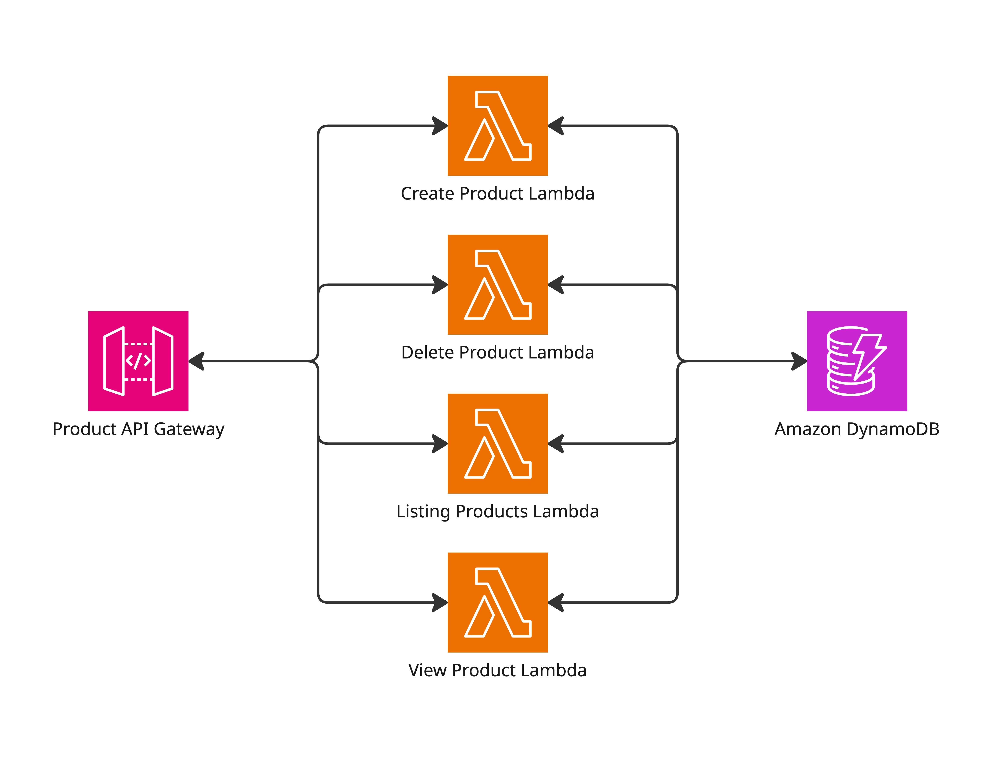

# backend

## Overview



## Getting Started

First of all, make sure you&#39;ve installed [pnpm](https://pnpm.io/installation).

Then, install dependencies:

```sh
$ pnpm i
```

Second, you will need to register and install LocalStack [here](https://docs.localstack.cloud/aws/getting-started/installation/) for AWS cloud service emulator.

After having your LocalStack running, execute the following commands:

```sh
$ pnpm infra-bootstrap
$ pnpm infra-deploy
```

Then, you will have the API url for your frontend.

## Workflow

Init CDK:

```sh
$ pnpm infra-bootstrap
```

Deploy:

```sh
$ pnpm infra-deploy
```

# Welcome to your CDK TypeScript project

This is a blank project for CDK development with TypeScript.

The `cdk.json` file tells the CDK Toolkit how to execute your app.

## Useful commands

- `npm run build` compile typescript to js
- `npm run watch` watch for changes and compile
- `npm run test` perform the jest unit tests
- `npx cdk deploy` deploy this stack to your default AWS account/region
- `npx cdk diff` compare deployed stack with current state
- `npx cdk synth` emits the synthesized CloudFormation template
